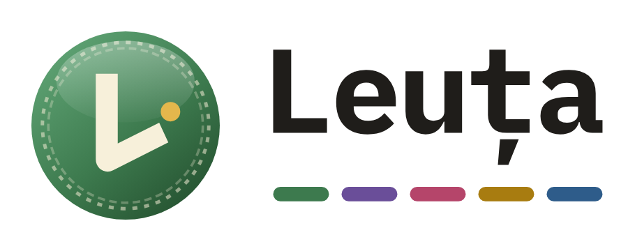

# Sigla Leuța

Fișierele oficiale ale siglei, pentru înregistrarea mărcii, tipar, presă, magazine de aplicații și rețele sociale. Toate pornesc din aceleași fișiere vectoriale. Textul „Leuța” e convertit în contururi, așa că sigla arată la fel pe orice calculator, fără să fie nevoie de fontul instalat.

<p align="center"></p>

## Ce fișier folosești

| Nevoie | Fișier |
|---|---|
| **Cererea de înregistrare a mărcii** (OSIM / EUIPO) | `inregistrare-marca/*.jpg`: 945 × 945 px, fond alb, 300 dpi (= 8 × 8 cm), sub 100 KB |
| Tipar, designer, agenție (orice mărime) | `svg/*.svg` sau `pdf/*.pdf` (vectoriale) |
| Site, prezentări, documente Word | `png/*.png` (fond transparent; varianta `-mic` pentru web) |
| Iconiță de aplicație, avatar pe rețele sociale | `png/leuta-icon-aplicatie.png` (2048 × 2048) |

## Variantele

| Variantă | Când o folosești |
|---|---|
| `leuta-logo` | varianta principală: moneda, numele și cele cinci benzi, pe fond deschis |
| `leuta-logo-fundal-inchis` | pe fond închis (text deschis, culorile din tema de noapte a aplicației) |
| `leuta-logo-negru` | o singură culoare: fax, ștampilă, gravură, documente alb-negru |
| `leuta-logo-alb` | o singură culoare, alb, peste fotografii sau fonduri colorate |
| `leuta-simbol` (+ `-negru`, `-alb`) | doar moneda, unde nu e loc de nume (favicon, avatar, colț de pagină) |
| `leuta-icon-aplicatie` | moneda pe pătratul rotunjit închis, ca pe ecranul telefonului |

În variantele cu o singură culoare, „L”-ul, punctul și chenarul monedei sunt decupate (transparente), nu albe. Sigla merge așa pe orice fond.

## Înregistrarea mărcii

În `inregistrare-marca/` sunt patru reprezentări gata de încărcat în formularul de depunere:

- `marca-logo-color.jpg`: marca combinată (simbol + nume), în culori
- `marca-logo-alb-negru.jpg`: aceeași, alb-negru
- `marca-simbol-color.jpg` și `marca-simbol-alb-negru.jpg`: doar simbolul (marcă figurativă)

Câteva lucruri de știut înainte de depunere:

- **Ce se protejează e exact imaginea depusă.** Marca combinată (`marca-logo-…`) acoperă sigla așa cum apare în aplicație. Separat, numele „Leuța” se poate înregistra și ca **marcă verbală** (doar textul, fără imagine), care protejează cuvântul indiferent de grafică.
- **Color sau alb-negru.** Varianta color revendică și culorile. Cea alb-negru e, de regulă, mai largă ca protecție, fiindcă nu e legată de o anumită culoare. Alege una pentru fiecare cerere.
- **Clasele de produse și servicii (Nisa)** sunt de obicei 9 (aplicații software descărcabile), 36 (servicii de informare financiară) și 42 (software ca serviciu). Lista exactă decide ce acoperă marca, așa că merită verificată cu un consilier în proprietate industrială.
- Verifică în formularul OSIM / EUIPO formatul cerut în acel moment. Fișierele de aici respectă cerințele uzuale (JPG, fond alb, 8 × 8 cm, sub 2 MB).

## Culori

| Culoare | HEX | RGB | Unde |
|---|---|---|---|
| Verde leu (1 leu) | `#3D7A4E` | 61 122 78 | moneda, prima bandă |
| Mov (5 lei) | `#6A4E99` | 106 78 153 | a doua bandă |
| Roșu (10 lei) | `#B5456A` | 181 69 106 | a treia bandă |
| Galben (50 lei) | `#A87C10` | 168 124 16 | a patra bandă |
| Albastru (100 lei) | `#2E5C8A` | 46 92 138 | a cincea bandă |
| Auriu | `#E4B74C` | 228 183 76 | punctul de lângă „L” |
| Crem | `#F7F0DA` | 247 240 218 | „L”-ul |
| Cerneală | `#1F1D1A` | 31 29 26 | numele „Leuța”, varianta negru |

Moneda are un gradient de la `#5FA374` (sus-stânga) la `#24502F` (jos-dreapta). Pentru tipar, cere tipografiei conversia în CMYK sau Pantone după aceste valori.

**Font:** IBM Plex Mono Bold (licență SIL Open Font License, liber pentru uz comercial), cu spațierea literelor strânsă la −3%.

## Reguli de folosire

- **Spațiu liber:** în jurul siglei lasă cel puțin jumătate din înălțimea monedei. Nimic (text, margine, altă imagine) nu intră în zona asta.
- **Mărime minimă:** logo-ul complet de la 24 mm (120 px) lățime; sub această mărime folosește doar simbolul, de la 8 mm (24 px).
- **Nu** întinde, nu înclina, nu schimba culorile, nu adăuga umbre sau contururi, nu rescrie numele cu alt font și nu muta elementele între ele.
- Pe fonduri închise folosește `leuta-logo-fundal-inchis` sau `leuta-logo-alb`, nu varianta principală.

## Regenerare

Fișierele se refac din aceleași surse ca sigla din aplicație (`src/components/Logo.tsx`, `src/app/icon.svg` și fontul din `src/lib/receipt/fonts`):

```bash
pip install fonttools
python3 brand/scripts/genereaza-svg.py brand/svg
node brand/scripts/exporta.mjs brand/svg brand    # necesită Playwright cu Chromium
```

© 2026 Vlad Gabriel Neculai. Toate drepturile rezervate. Numele „Leuța” și sigla nu pot fi folosite pentru alte produse sau servicii (vezi [LICENSE](../LICENSE)).
